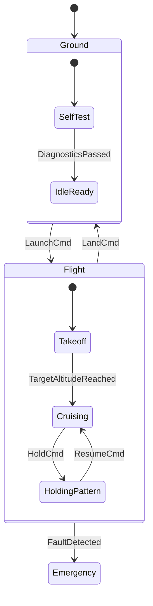
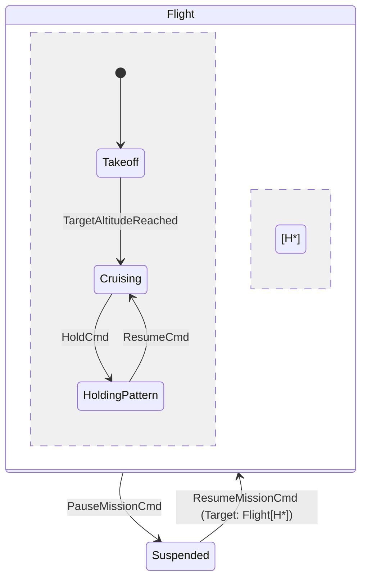

# Tutorial 3: Hierarchical Statecharts (HFSM) & History

As software grows, flat state machines suffer from **combinatorial state explosion**: every new state requires duplicate transition paths for common events like `EmergencyStop`, `Reset`, or `Pause`.

In this tutorial, you will learn how **`fsmc`** implements **Hierarchical State Machines (HFSM)**:

- Organizing behaviors into **Composite States** (Superstates and Sub-states).
- **Transition Inheritance**: Handling global events uniformly across an entire state hierarchy.
- **Shallow History (`[H]`)** and **Deep History (`[H*]`)** memory restoration.

---

## 1. The Architecture of a Hierarchical State Machine

Consider an autonomous drone flight controller:

- **`Ground`** (Initial Superstate):
  - Sub-states: `SelfTest`, `IdleReady`.
- **`Flight`** (Operational Superstate):
  - Sub-states: `Takeoff`, `Cruising`, `HoldingPattern`.
- **`Emergency`**: A safe state triggered by `FaultDetected` from *any* flight state.


```mermaid
stateDiagram-v2
    [*] --> Ground

    state Ground {
        [*] --> SelfTest
        SelfTest --> IdleReady: DiagnosticsPassed
    }

    state Flight {
        [*] --> Takeoff
        Takeoff --> Cruising: TargetAltitudeReached
        Cruising --> HoldingPattern: HoldCmd
        HoldingPattern --> Cruising: ResumeCmd
    }

    Ground --> Flight: LaunchCmd
    Flight --> Ground: LandCmd
    Flight --> Emergency: FaultDetected
```

Notice how `FaultDetected` is attached to the **`Flight` superstate**. If a fault occurs while in `Takeoff`, `Cruising`, or `HoldingPattern`, the transition triggers immediately without writing three separate transitions!

---

## 2. Modeling Composite States in SysML v2

```sysml
state def FlightController {
    entry; then Ground;

    state Ground {
        entry; then SelfTest;
        state SelfTest;
        state IdleReady;

        transition diag_ok
            first SelfTest
            accept DiagnosticsPassed
            then IdleReady;
    }

    state Flight {
        entry; then Takeoff;
        state Takeoff;
        state Cruising;
        state HoldingPattern;

        transition t_alt_reached
            first Takeoff
            accept TargetAltitudeReached
            then Cruising;

        transition t_hold
            first Cruising
            accept HoldCmd
            then HoldingPattern;

        transition t_resume
            first HoldingPattern
            accept ResumeCmd
            then Cruising;
    }

    state Emergency;

    transition t_launch
        first Ground
        accept LaunchCmd
        then Flight;

    transition t_land
        first Flight
        accept LandCmd
        then Ground;

    transition t_abort
        first Flight
        accept FaultDetected
        then Emergency;
}
```

---

## 3. History Pseudostates: `[H]` vs `[H*]`

What happens if the drone is temporarily suspended by a `PauseMissionCmd` and later receives `ResumeMissionCmd`?

Without history, entering `Flight` would always re-execute the default initial substate (`Takeoff`). With **History**, the machine remembers where it left off:


```mermaid
stateDiagram-v2
    state Flight {
        [*] --> Takeoff
        Takeoff --> Cruising: TargetAltitudeReached
        Cruising --> HoldingPattern: HoldCmd
        HoldingPattern --> Cruising: ResumeCmd
        --
        [H*]
    }

    Flight --> Suspended: PauseMissionCmd
    Suspended --> Flight: ResumeMissionCmd (Target: Flight[H*])
```

- **Shallow History (`[H]`)**: Restores the direct child state of `Flight`.
- **Deep History (`[H*]`)**: Restores the nested active state recursively across all levels of hierarchy.

---

## 4. Compile and Run the HFSM in C++

Save the drone flight model as `flight_controller.sysml` and compile it with `fsmc`:

```bash
fsmc -i flight_controller.sysml -o flight_controller_fsm.hpp --target cpp --std 20 --standalone --namespace drone --name FlightControllerFSM
```

### Complete Verification Harness (`main.cpp`)

```cpp
#include <iostream>
#include <cassert>
#include "flight_controller_fsm.hpp"

int main() {
    using namespace drone;

    // 1. Stack-allocated hierarchical state machine
    FlightControllerFSM fsm;

    // Initial state is SelfTest (default child of Ground)
    std::cout << "Initial state: " << fsm.current_state_name() << "\n";
    assert(fsm.is_in<SelfTest>());

    // 2. Pre-flight diagnostics
    fsm.dispatch(DiagnosticsPassed{});
    std::cout << "State after DiagnosticsPassed: " << fsm.current_state_name() << "\n";
    assert(fsm.is_in<IdleReady>());

    // 3. LaunchCmd: Enters Flight superstate (targeting initial substate Takeoff)
    fsm.dispatch(LaunchCmd{});
    std::cout << "State after LaunchCmd: " << fsm.current_state_name() << "\n";
    assert(fsm.is_in<Takeoff>());

    // 4. Reach cruising altitude
    fsm.dispatch(TargetAltitudeReached{});
    std::cout << "State after TargetAltitudeReached: " << fsm.current_state_name() << "\n";
    assert(fsm.is_in<Cruising>());

    // 5. Enter holding pattern
    fsm.dispatch(HoldCmd{});
    std::cout << "State after HoldCmd: " << fsm.current_state_name() << "\n";
    assert(fsm.is_in<HoldingPattern>());

    // 6. Transition Inheritance Test:
    // FaultDetected is defined on the Flight superstate.
    // While in HoldingPattern, receiving FaultDetected triggers the superstate transition!
    fsm.dispatch(FaultDetected{});
    std::cout << "State after FaultDetected (inherited from Flight): " 
              << fsm.current_state_name() << "\n";
    assert(fsm.is_in<Emergency>());

    std::cout << "\n[SUCCESS] Hierarchical state machine and transition inheritance verified!\n";
    return 0;
}
```

### Build & Run

```bash
g++ -std=c++20 main.cpp -o hfsm_app
./hfsm_app
```

**Output:**
```text
Initial state: SelfTest
State after DiagnosticsPassed: IdleReady
State after LaunchCmd: Takeoff
State after TargetAltitudeReached: Cruising
State after HoldCmd: HoldingPattern
State after FaultDetected (inherited from Flight): Emergency

[SUCCESS] Hierarchical state machine and transition inheritance verified!
```

---

## Next Steps

Now that you can design expressive, hierarchical statecharts and execute them in C++, let's explore how to **mathematically prove their safety** before deploying to production in **[Tutorial 4: Formal Verification & Model Checking](04_formal_verification.md)**.


