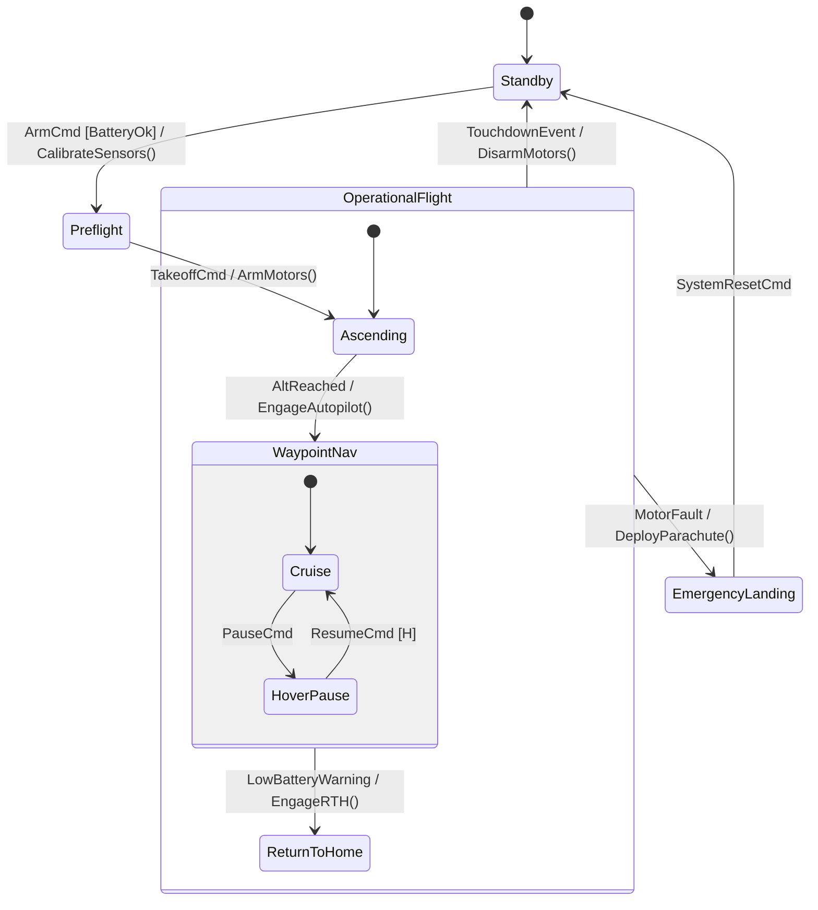

# 6. Complete Real-World Case Study: Autonomous UAV Flight Controller

In this capstone tutorial, we bring together all concepts learned across Steps 1 to 5 into an end-to-end, safety-critical embedded project: an **Autonomous UAV Flight & Mission Controller**.

We will design the system in **OMG SysML v2**, verify safety properties formally with **SMV/nuXmv**, compile it with **`fsmc` via CMake**, and implement a complete **C++20 real-time control loop**.

---

## 1. System Requirements & Architecture

Our autonomous drone flight computer must satisfy the following operational requirements:



### Safety Requirements (RTM Matrix)
- **`REQ-UAV-001` (Battery Invariant)**: Motors cannot be armed if battery level is below $20\%$.
- **`REQ-UAV-002` (Fail-Safe Disarm)**: In `EmergencyLanding`, throttle must be clamped to zero and parachute relay deployed.
- **`REQ-UAV-003` (History Resumption)**: Resuming from `HoverPause` must restore the exact active substate without re-executing entry initializers.

---

## 2. Formal SysML v2 Specification (`flight_controller.sysml`)

Here is the complete formal MBSE model specifying ports, attributes, composite states, guards, and temporal safety requirements:

```sysml
state def UAVFlightController {
    // 1. Segregated InPorts (Sensor telemetry snapshot)
    in port battery_pct : Real { assert constraint { self >= 0.0 and self <= 100.0; } }
    in port altitude_m : Real;
    in port imu_healthy : Boolean;

    // 2. Segregated OutPorts (Actuator command buffer)
    out port motor_throttle : Real;
    out port parachute_deployed : Boolean;
    out port buzzer_active : Boolean;

    // 3. Persistent Registers (Datapath memory)
    attribute waypoint_index : Integer = 0;
    attribute flight_time_seconds : Integer = 0;
    attribute fault_code : Integer = 0;

    entry; then Standby;

    // 4. Statechart Topology
    state Standby;
    state Preflight;

    state OperationalFlight {
        entry; then Ascending;
        
        state Ascending;
        
        state WaypointNav {
            entry; then Cruise;
            state Cruise;
            state HoverPause;

            transition pause_cmd first Cruise accept PauseCmd then HoverPause;
            // Shallow history restoration:
            transition resume_cmd first HoverPause accept ResumeCmd then WaypointNav[H];
        }

        state ReturnToHome;

        transition alt_reached first Ascending accept AltReached then WaypointNav;
        transition low_battery first WaypointNav if battery_pct < 20.0 then ReturnToHome;
    }

    state EmergencyLanding;

    // Transitions
    transition arm_cmd first Standby accept ArmCmd 
        if battery_pct >= 20.0 and imu_healthy 
        then Preflight;

    transition takeoff_cmd first Preflight accept TakeoffCmd then OperationalFlight;

    transition fault_trip first OperationalFlight accept MotorFaultTrip 
        do { parachute_deployed = true; motor_throttle = 0.0; }
        then EmergencyLanding;

    transition land_complete first OperationalFlight accept TouchdownEvent then Standby;
    transition reset_complete first EmergencyLanding accept ResetCmd then Standby;
}
```

---

## 3. Formal Safety Verification

Before generating code, verify the formal model against LTL safety temporal properties using `fsmc`'s verification pass:

```bash
# Verify SMT guard satisfiability, deadlocks, and temporal safety invariants
fsmc --verify --verify-engine=nuxmv flight_controller.sysml
```

**Verification Results Output:**
```
[PASS] SMT Guard Satisfiability: All transitions disjoint (0 warnings).
[PASS] Deadlock Freedom: All non-terminal states have deterministic outgoing paths.
[PASS] LTL Invariant "G (EmergencyLanding -> motor_throttle == 0.0)": TRUE
[PASS] LTL Invariant "G (LowBattery -> F ReturnToHome)": TRUE
[PASS] Requirement Traceability Matrix: REQ-UAV-001, REQ-UAV-002, REQ-UAV-003 verified.
```

---

## 4. Modern CMake Integration (`CMakeLists.txt`)

Integrate code generation into your CMake build pipeline using `fsmc_target_sources`:

```cmake
cmake_minimum_required(VERSION 3.20)
project(uav_flight_computer LANGUAGES CXX)

set(CMAKE_CXX_STANDARD 20)
set(CMAKE_CXX_STANDARD_REQUIRED ON)

find_package(fsmc REQUIRED)

add_executable(flight_computer main.cpp)

# Automatically compile SysML v2 into C++20 header at build time
fsmc_target_sources(flight_computer
    DIAGRAMS flight_controller.sysml
    OUTPUT_DIR ${CMAKE_CURRENT_BINARY_DIR}/generated
    STANDARD 20
    NAMESPACE uav::fsm
)

target_link_libraries(flight_computer PRIVATE fsmc::runtime)
```

---

## 5. Production C++20 Real-Time Execution Loop (`main.cpp`)

Here is the complete application code implementing the control loop, hardware sensor snapshots, and fail-safe handling:

```cpp
#include <iostream>
#include <chrono>
#include <thread>
#include <cassert>
#include "generated/flight_controller.hpp"

using namespace uav::fsm;
using namespace std::chrono_literals;

// ----------------------------------------------------------------------------
// Concrete Service Provider (Hardware Driver Interfaces)
// ----------------------------------------------------------------------------
struct UAVHardwareServices {
    void log_telemetry(std::string_view msg) {
        std::cout << "[UAV TELEMETRY] " << msg << "\n";
    }
    void trigger_radio_beacon() {
        std::cout << "[RADIO] Emergency beacon pulsing on 433 MHz.\n";
    }
};

// ----------------------------------------------------------------------------
// Main Mission Execution Control Loop
// ----------------------------------------------------------------------------
int main() {
    UAVFlightControllerRegisters reg{};
    UAVHardwareServices srv;
    
    // Instantiate Synchronous FSM on caller's stack (Zero-Heap Allocation)
    UAVFlightControllerFSM fsm(reg, srv);
    
    std::cout << "========================================================\n";
    std::cout << "  Autonomous UAV Flight Computer Initialized\n";
    std::cout << "  Current State: " << fsm.current_state_name() << "\n";
    std::cout << "========================================================\n";

    // 1. Arming Phase
    UAVFlightControllerInPorts in{.battery_pct = 95.0f, .altitude_m = 0.0f, .imu_healthy = true};
    UAVFlightControllerOutPorts out{};

    std::cout << "\n--> [Pilot] Arming drone...\n";
    fsm::dispatch_result res = fsm.dispatch(ArmCmd{}, in, out);
    assert(res.is_success());
    std::cout << "State: " << fsm.current_state_name() << "\n"; // Preflight

    // 2. Takeoff Phase
    std::cout << "\n--> [Autopilot] Taking off...\n";
    fsm.dispatch(TakeoffCmd{}, in, out);
    std::cout << "State: " << fsm.current_state_name() << "\n"; // Ascending

    // 3. Ascending to 120m Cruise Altitude
    in.altitude_m = 120.0f;
    fsm.dispatch(AltReached{}, in, out);
    std::cout << "State: " << fsm.current_state_name() << "\n"; // Cruise (inside WaypointNav)

    // 4. Mission Pause & Shallow History Verification
    std::cout << "\n--> [Pilot] Pausing mission for air traffic clearance...\n";
    fsm.dispatch(PauseCmd{}, in, out);
    std::cout << "State: " << fsm.current_state_name() << "\n"; // HoverPause

    std::cout << "--> [Pilot] Airspace clear. Resuming mission...\n";
    fsm.dispatch(ResumeCmd{}, in, out);
    std::cout << "State: " << fsm.current_state_name() << "\n"; // Cruise (Restored via [H])
    assert(fsm.current_state_name() == "Cruise");

    // 5. Critical In-Flight Hardware Fault & Emergency Parachute Deployment
    std::cout << "\n--> [Hardware Monitor] MOTOR 3 SHORT CIRCUIT FAULT!\n";
    fsm.dispatch(MotorFaultTrip{}, in, out);
    
    std::cout << "State: " << fsm.current_state_name() << "\n"; // EmergencyLanding
    assert(out.parachute_deployed == true);
    assert(out.motor_throttle == 0.0f);
    std::cout << "[SAFETY VERIFIED] Throttle cut to 0.0%, Parachute DEPLOYED!\n";

    // 6. Reset on Ground
    fsm.dispatch(ResetCmd{}, in, out);
    std::cout << "\nState after ground recovery: " << fsm.current_state_name() << "\n"; // Standby
    assert(fsm.is_in<Standby>());

    std::cout << "\n[SUCCESS] All flight safety requirements and lifecycle transitions passed!\n";
    return 0;
}
```

---

## 6. Key Takeaways

1. **Model-Driven Development (MBSE)**: The entire statechart, memory domains, and safety rules are authored in a clean, single-source-of-truth model file (`flight_controller.sysml`).
2. **Mathematical Verification Before Deployment**: Formal model checkers guarantee the absence of deadlocks, unreachable states, and safety invariant violations before a single line of C++ is compiled.
3. **Zero-Heap Determinism**: The generated C++ state machine executes entirely on the stack with $O(1)$ dispatch time, making it suitable for DO-178C / ISO 26262 safety-critical avionics.
4. **Seamless History Restoration**: Shallow History `[H]` allows complex hierarchical navigation states to be paused and resumed without custom state-tracking boilerplate.
