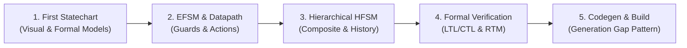

# Step-by-Step Tutorials

Welcome to the **`fsmc` Hands-On Tutorial Series**!

This series of progressive guides walks you through the entire lifecycle of designing, enriching, formally verifying, and integrating state machines using the `fsmc` universal compiler toolchain.

---

## 🗺️ Learning Path Progression

---

## Tutorial Roadmap

1. **[Step 1: Designing Your First State Machine](01_first_statechart.md)**
   Learn how to model states, triggers, and transitions using visual diagrams (PlantUML, Mermaid) and formal notations (SysML v2), and inspect how `fsmc` parses them into a canonical Intermediate Representation (`FsmIr`).

2. **[Step 2: Extended State Machines (EFSM), Guards & Datapath](02_guards_and_actions.md)**
   Enrich your statechart with context variables, boolean condition guards (`and`, `or`, `not`), and deterministic state/transition action effects.

3. **[Step 3: Hierarchical Statecharts (HFSM) & History](03_hierarchical_hfsm.md)**
   Structure complex behavior with nested composite states, transition inheritance, shallow history (`[H]`), and deep history (`[H*]`).

4. **[Step 4: Formal Verification & Model Checking](04_formal_verification.md)**
   Mathematically prove system safety before generating code. Specify temporal logic formulas (LTL & CTL), run interval analysis, and generate requirement traceability matrices (RTM).

5. **[Step 5: Code Generation & Build Integration](05_code_generation_and_integration.md)**
   Understand the non-destructive **Generation Gap Pattern**, compile your models into standalone or modular code, integrate seamlessly with CMake, and explore how `fsmc`'s target-agnostic design bridges models to diverse execution targets.

---

Let's begin with **[Step 1: Designing Your First State Machine](01_first_statechart.md)**!
