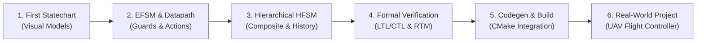

# Step-by-Step Tutorials

This tutorial curriculum guides developers and systems engineers through designing, enriching, formally verifying, and deploying state machines using the `fsmc` compiler toolchain.

---

## Curriculum Overview

---

## Tutorial Roadmap

| Step | Topic | Key Concepts Covered |
| :--- | :--- | :--- |
| **[Step 1: First State Machine](01_first_statechart.md)** | Model states, events, and transitions | Ingesting SysML v2, PlantUML, and Mermaid into canonical IR (`FsmIr`). |
| **[Step 2: EFSM, Guards & Actions](02_guards_and_actions.md)** | Extended state machine datapath | Defining `InPorts`, `OutPorts`, `Registers`, boolean guard trees, and action effects. |
| **[Step 3: Hierarchical HFSM & History](03_hierarchical_hfsm.md)** | Structuring complex behavior | Nested composite states, transition inheritance, shallow `[H]` and deep `[H*]` history. |
| **[Step 4: Formal Verification & Safety](04_formal_verification.md)** | Mathematical safety validation | EFSM interval analysis, temporal model checking (LTL/CTL), nuXmv export, and RTM export. |
| **[Step 5: Code Generation & Build Integration](05_code_generation_and_integration.md)** | Build system integration | Modern CMake integration (`fsmc_target_sources`) and the Generation Gap pattern. |
| **[Step 6: Complete Real-World Case Study](06_real_world_case_study.md)** | End-to-end mission controller | Complete autonomous drone flight controller from SysML v2 to C++20 real-time loop. |

---

To get started, proceed to **[Step 1: First State Machine](01_first_statechart.md)**.
