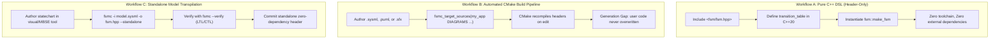
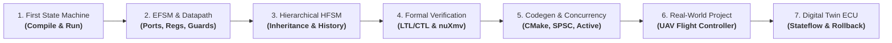

# Step-by-Step Tutorials

This tutorial curriculum guides developers, systems engineers, and embedded architects through designing, enriching, formally verifying, and deploying state machines using **`fsmc`**.

---

## 3 Ways to Use `fsmc`

Before diving into the tutorials, choose the integration workflow that best matches your project architecture:

```mermaid
flowchart TD
    subgraph W1 ["Workflow A: Pure C++ DSL (Header-Only)"]
        A1["Include &lt;fsm/fsm.hpp&gt;"] --> A2["Define transition_table in C++20"]
        A2 --> A3["Instantiate fsm::make_fsm"]
        A3 --> A4["Zero toolchain, Zero external dependencies"]
    end

    subgraph W2 ["Workflow B: Automated CMake Build Pipeline"]
        B1["Author .sysml, .puml, or .sfx"] --> B2["fsmc_target_sources(my_app DIAGRAMS ...)"]
        B2 --> B3["CMake recompiles headers on edit"]
        B3 --> B4["Generation Gap: user code never overwritten"]
    end

    subgraph W3 ["Workflow C: Standalone Model Transpilation"]
        C1["Author statechart in visual/MBSE tool"] --> C2["fsmc -i model.sysml -o fsm.hpp --standalone"]
        C2 --> C3["Verify with fsmc --verify (LTL/CTL)"]
        C3 --> C4["Commit standalone zero-dependency header"]
    end
```

| Integration Approach | Primary Use Case | Required Tools |
| :--- | :--- | :--- |
| **Pure C++ Engine** | Modern C++ projects wanting a fast, type-safe, zero-heap FSM library. | C++20 compiler (`g++`, `clang++`, MSVC). |
| **CMake Pipeline** | Engineering teams using Model-Based Design (MBSE) with automatic build-time code generation. | CMake $\ge 3.16$, `fsmc` compiler. |
| **Standalone CLI** | Air-gapped CI/CD, formal safety verification audits (DO-178C, ISO 26262), and visual model conversion. | `fsmc` executable. |

---

## Curriculum Overview

The tutorial curriculum is hands-on: **every step produces working, testable code** while progressively introducing advanced capabilities:

```mermaid
flowchart LR
    Step1["1. First State Machine<br/><b>(Compile & Run)</b>"] --> Step2["2. EFSM & Datapath<br/><b>(Ports, Regs, Guards)</b>"]
    Step2 --> Step3["3. Hierarchical HFSM<br/><b>(Inheritance & History)</b>"]
    Step3 --> Step4["4. Formal Verification<br/><b>(LTL/CTL & nuXmv)</b>"]
    Step4 --> Step5["5. Codegen & Concurrency<br/><b>(CMake, SPSC, Active)</b>"]
    Step5 --> Step6["6. Real-World Project<br/><b>(UAV Flight Controller)</b>"]
    Step6 --> Step7["7. Digital Twin ECU<br/><b>(Stateflow & Rollback)</b>"]
```

---

## Tutorial Roadmap

| Step | Topic | What You Will Build & Run |
| :--- | :--- | :--- |
| **[Step 1: First State Machine](01_first_statechart.md)** | Core state machine concepts | Model a Connection Manager, compile it to C++20 with `fsmc`, and run event dispatches in under 60 seconds. |
| **[Step 2: EFSM, Guards & Actions](02_guards_and_actions.md)** | Extended state machine datapath | Add input contracts (`InPorts`), output relays (`OutPorts`), persistent `Registers`, and boolean guard expressions. |
| **[Step 3: Hierarchical HFSM & History](03_hierarchical_hfsm.md)** | Structuring complex behavior | Model nested composite states, global transition inheritance, and shallow `[H]` / deep `[H*]` memory restoration. |
| **[Step 4: Formal Verification & Safety](04_formal_verification.md)** | Mathematical safety validation | Verify deadlock freedom, check temporal logic (LTL/CTL), run interval analysis, and generate Requirement Traceability (RTM). |
| **[Step 5: Code Generation & Build Integration](05_code_generation_and_integration.md)** | Build systems & concurrency | Integrate `fsmc_target_sources` in CMake, use the Generation Gap pattern, and select execution engines (Sync, SPSC, Active Object). |
| **[Step 6: Complete Real-World Case Study](06_real_world_case_study.md)** | End-to-end mission controller | Deploy an autonomous UAV flight computer from formal SysML v2 to a full C++20 real-time control loop. |
| **[Step 7: Stateflow Digital Twin ECU](07_stateflow_digital_twin_ecu.md)** | Automotive ECU & Time-Travel | Import MathWorks Stateflow XML (`.sfx`), optimize connective junctions, and perform zero-heap rollback with `fsm::snapshot_recorder`. |

---

To get started with your first running state machine, proceed to **[Step 1: First State Machine](01_first_statechart.md)**.

