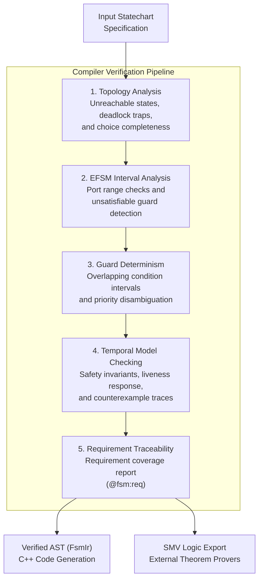

# Formal Verification & Static Analysis

State machines in embedded and real-time systems often suffer from subtle edge cases: deadlocks, unreachable states, overlapping guards, and race conditions between asynchronous events.

`fsmc` incorporates compile-time static analysis and model checking passes directly into the compiler pipeline. These checks help identify structural flaws, verify temporal properties, and analyze numerical data paths before generating C++ code.

---

## Verification Quickstart

Given a state machine model with formal annotations (`controller.sysml`):

```sysml
package SystemOperations {
    state def Controller {
        in port battery_charge : Real { assert constraint { self >= 0.0 and self <= 100.0; } }
        
        // Safety property: mutually exclusive operational states
        @fsm:property DisjointState = "G !(Active && Fault)";

        // Liveness property: low battery leads to SafeHold
        @fsm:property SafeRecovery = "G (LowBattery -> F SafeHold)";

        entry; then Standby;
        state Standby;
        state Active;
        state SafeHold;
        state Fault;
        // ...
    }
}
```

Run the compiler verification pass with:

```bash
fsmc -i controller.sysml --verify
```

### Compiler Output Example:
```text
[INFO] Parsed 4 states, 6 transitions from controller.sysml
[INFO] Verification Pipeline:
  [PASS] Topology: 0 deadlocks, 0 unreachable states
  [PASS] Interval Analysis: Variable domains within specified bounds
  [PASS] Guard Disjointness: Competing transitions are deterministic
  [PASS] Model Checking:
         ├── [PASS] Property 'DisjointState': G !(Active && Fault)
         └── [PASS] Property 'SafeRecovery': G (LowBattery -> F SafeHold)
[SUCCESS] Verification completed: 0 errors, 0 warnings.
```

---

## The Verification Pipeline

`fsmc` evaluates models through a sequence of static analysis and model checking passes:



---

## Verification Capabilities

| Analysis Module | Primary Target | Description | Guide |
| :--- | :--- | :--- | :--- |
| **Model Checking (LTL/CTL)** | Temporal Properties | Evaluates safety invariants (`INVARSPEC`), reachability, and response formulas against the transition graph. | [Model Checking](model_checking.md) |
| **EFSM Interval Analysis** | Numerical Variables | Abstract interpretation bounding numerical variables and detecting dead guards. | [Interval Analysis](interval_analysis.md) |
| **MC/DC Test Synthesis** | Boolean Decisions | Derives independence test pairs and generates GoogleTest C++ suites for compound guard decisions. | [MC/DC Coverage](mcdc_synthesis.md) |
| **Requirement Traceability (RTM)** | Specification Auditing | Generates Markdown and JSON requirement coverage reports linking `@fsm:req` tags. | [RTM Specification](rtm_matrix.md) |
| **SMV Logic Export** | External Tooling | Exports standard SMV specifications for external verification with nuXmv / NuSMV. | [nuXmv / SMV Guide](../formal_languages/smv_nuxmv.md) |

---

## Documentation Roadmap

Explore the dedicated chapters below for detailed specifications, mathematical principles, and practical examples:

- **[Temporal Model Checking (LTL & CTL)](model_checking.md)**: Details on transition graph evaluation, temporal operators (`G`, `F`, `U`, `X`, `->`), and counterexample failure traces.
- **[EFSM Data Path & Interval Analysis](interval_analysis.md)**: Variable interval propagation $[\text{lo}, \text{hi}]$ and detecting unsatisfiable guards (`W0302`).
- **[MC/DC Test Synthesis](mcdc_synthesis.md)**: Synthesis of GoogleTest C++ suites verifying Modified Condition / Decision Coverage on guard conditions.
- **[Requirement Traceability Matrix (RTM)](rtm_matrix.md)**: Structuring requirements with `@fsm:req` and exporting coverage reports.
- **[nuXmv / SMV Symbolic Logic Export](../formal_languages/smv_nuxmv.md)**: Translating statecharts into canonical SMV files for external toolchains.
