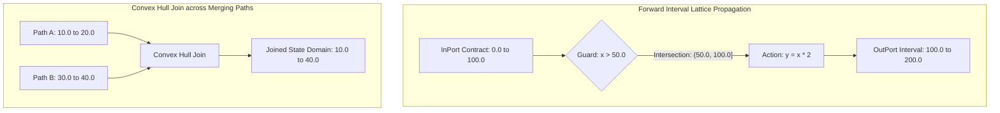

# EFSM Data Path Interval Analysis & Contract Verification

Extended Finite State Machines (EFSM) couple discrete state transitions with continuous or numeric variables. In complex systems, state transitions depend on data path variables (e.g. `in.altitude > 1000.0`, `in.batterySoC < 20.0`, `reg.retryCount >= 3`).

`fsmc` includes the `EFSMIntervalAnalyzer`, a static abstract interpretation engine based on interval lattices $[\text{lo}, \text{hi}]$ that propagates variable and port domains forward across all reachable state paths to detect:
1. **Unsatisfiable transition guards** (dead branches).
2. **Out-of-range action assignments** violating `InPorts`, `OutPorts`, or `Registers` contracts.

---

## 1. Abstract Interpretation Engine

### Interval Lattice Mechanics
Each variable in `InPorts`, `OutPorts`, and `Registers` is assigned a domain interval $[\text{lo}, \text{hi}]$ over the extended real numbers $\mathbb{R} \cup \{-\infty, +\infty\}$:



- **InPorts Contracts**: Initialized directly from port range annotations (`min_value`, `max_value`, e.g. `sensor_temp : [-50.0, 150.0]`).
- **Registers**: Initialized from their default initial value (e.g. `cycle_count = 0` $\implies [0, 0]$).
- **Assignments mutate intervals**:
  - `v += 5.0` $\implies [\text{lo} + 5, \text{hi} + 5]$
  - `v = 0` $\implies [0, 0]$
  - `v = in.sensor_temp` $\implies \text{Domain}(in.sensor_temp)$
- **State joins compute the least upper bound (convex hull)** across converging transition paths:
  - $[10, 20] \sqcup [30, 40] = [10, 40]$

---

## 2. Dead Branch & Unsatisfiable Guard Detection (`W0302`)

When evaluating a guarded transition, the analyzer intersects the variable's reachable interval domain with the guard constraint:

$$\text{Domain}(\text{batteryLevel}) \cap (120.0, +\infty) = [0.0, 100.0] \cap (120.0, +\infty) = \emptyset$$

Because the intersection is empty, the guard can never evaluate to `true` at runtime.

### Example: Unsatisfiable Guard

=== "Model with Dead Guard (Triggers Warning)"
    ```sysml
    package DroneSystem {
        state def PowerController {
            in port battery_soc : Real { assert constraint { self >= 0.0 and self <= 100.0; } }

            state Cruising;
            state TurboMode;

            // Flaw: battery_soc contract is [0.0, 100.0], so (> 120.0) is mathematically dead
            transition boost first Cruising if in.battery_soc > 120.0 then TurboMode;
        }
    }
    ```

=== "Compiler Diagnostic Output"
    ```text
    warning[W0302]: Guard 'in.battery_soc > 120.0' on transition 'Cruising -> TurboMode' is unsatisfiable.
      --> power_controller.sysml:9:9
       |
     9 |         transition boost first Cruising if in.battery_soc > 120.0 then TurboMode;
       |         ^^^^^^^^^^^^^^^^^^^^^^^^^^^^^^^^^^^^^^^^^^^^^^^^^^^^^^^^^ Variable range [0.0, 100.0] never satisfies (> 120.0)
    ```

=== "Resolved Model (Clean)"
    ```sysml
    package DroneSystem {
        state def PowerController {
            in port battery_soc : Real { assert constraint { self >= 0.0 and self <= 100.0; } }

            state Cruising;
            state TurboMode;

            // Fixed: valid threshold within [0.0, 100.0] domain
            transition boost first Cruising if in.battery_soc > 80.0 then TurboMode;
        }
    }
    ```

---

## 3. OutPort Contract Violation Detection

When a transition action assigns an expression whose computed interval falls outside the declared `OutPort` contract, `fsmc` flags the out-of-bounds assignment statically.

### Example: Contract Range Violation

=== "Model with Port Violation (Triggers Warning)"
    ```sysml
    package ThermalManagement {
        state def HeaterUnit {
            out port heater_duty_cycle : Real { assert constraint { self >= 0.0 and self <= 100.0; } }

            state Standby;
            state Active;

            // Flaw: 150.0 exceeds the declared OutPort contract [0.0, 100.0]
            transition heat first Standby do action { out.heater_duty_cycle = 150.0; } then Active;
        }
    }
    ```

=== "Compiler Diagnostic Output"
    ```text
    warning[W_PORT_RANGE_VIOLATION]: OutPort contract violation on transition 'Standby -> Active'.
      --> heater_unit.sysml:9:9
       |
     9 |         transition heat first Standby do action { out.heater_duty_cycle = 150.0; } then Active;
       |         ^^^^^^^^^^^^^^^^^^^^^^^^^^^^^^^^^^^^^^^^^^^^^^^^^^^^^^^^^^^^^^^^^^^^^^^^^ Value 150.0 exceeds OutPort bound [0.0, 100.0]
    ```

=== "Resolved Model (Clean)"
    ```sysml
    package ThermalManagement {
        state def HeaterUnit {
            out port heater_duty_cycle : Real { assert constraint { self >= 0.0 and self <= 100.0; } }

            state Standby;
            state Active;

            // Fixed: clamped value conforming to port contract
            transition heat first Standby do action { out.heater_duty_cycle = 100.0; } then Active;
        }
    }
    ```

---

## 4. Guard Mutual-Exclusivity Analysis (`W0301`)

When multiple transitions share the same `(source_state, trigger_event)` and have the same priority, `fsmc` verifies whether their guard intervals overlap. If an overlap is detected, the transition order is non-deterministic.

### Example: Overlapping Guard Collision

=== "Model with Overlapping Guards (Triggers Warning)"
    ```sysml
    package FlightSystem {
        state def NavigationMode {
            in port altitude : Real;

            state Normal;
            state HighAltitude;
            state LowAltitude;

            // Flaw: when altitude is between 500.0 and 800.0, both transitions evaluate to true
            transition to_high first Normal if in.altitude > 500.0 then HighAltitude;
            transition to_low  first Normal if in.altitude < 800.0 then LowAltitude;
        }
    }
    ```

=== "Compiler Diagnostic Output"
    ```text
    warning[W0301]: Potentially non-deterministic overlapping guards on state 'Normal'.
      --> navigation.sysml:10:9
       |
    10 |         transition to_high first Normal if in.altitude > 500.0 then HighAltitude;
    11 |         transition to_low  first Normal if in.altitude < 800.0 then LowAltitude;
       |         -------------------------------------------------------------------------
       |         Intersecting interval (500.0, 800.0) matches multiple unprioritized branches.
    ```

=== "Resolved with Disjoint Guards"
    ```sysml
    package FlightSystem {
        state def NavigationMode {
            in port altitude : Real;

            state Normal;
            state HighAltitude;
            state LowAltitude;

            // Resolution A: Provably disjoint interval bounds
            transition to_high first Normal if in.altitude >= 600.0 then HighAltitude;
            transition to_low  first Normal if in.altitude <  600.0 then LowAltitude;
        }
    }
    ```

=== "Resolved with Explicit Priorities"
    ```sysml
    package FlightSystem {
        state def NavigationMode {
            in port altitude : Real;

            state Normal;
            state HighAltitude;
            state LowAltitude;

            // Resolution B: Priority disambiguation (Priority 1 evaluates before Priority 2)
            @fsm:priority 1
            transition to_high first Normal if in.altitude > 500.0 then HighAltitude;

            @fsm:priority 2
            transition to_low  first Normal if in.altitude < 800.0 then LowAltitude;
        }
    }
    ```

---

## 5. Formal SMT & Model Checking Export

The computed interval bounds are automatically fed into the formal backend serializers:

- **nuXmv / NuSMV**: Bounded variables (`VAR sensor_temp : -50..150;`) and contract invariants (`INVAR sensor_temp >= -50 & sensor_temp <= 150;`).
- **SysML v2**: Exported `assert constraint { self >= min and self <= max; }`.

```bash
# Run the full formal verification pipeline via CLI
fsmc -i model.sysml --verify
```
