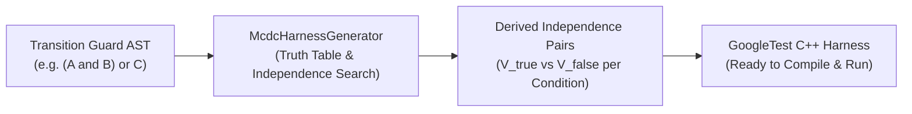

# Modified Condition / Decision Coverage (MC/DC) Test Synthesis

`fsmc` features an automated test synthesis engine that analyzes composite boolean guard conditions and generates standalone **GoogleTest C++ test harnesses** demonstrating **Modified Condition / Decision Coverage (MC/DC)**.

---

## 1. What is MC/DC Coverage?

In high-integrity software engineering, simple statement or branch coverage is insufficient when transitions depend on compound boolean decisions:

$$\text{Decision} = (A \land B) \lor C$$

MC/DC requires demonstrating that:
1. Every decision has taken all possible outcomes (true and false).
2. Every condition within the decision has taken all possible outcomes (true and false).
3. Each condition has been shown to **independently affect** the decision's outcome.

To prove condition $C_i$ has an independent effect, the test suite must contain an **Independence Pair** of test vectors $(V_{\text{true}}, V_{\text{false}})$ where:
* Condition $C_i$ flips between `true` in $V_{\text{true}}$ and `false` in $V_{\text{false}}$.
* All other conditions $C_j$ ($j \ne i$) remain fixed to identical boolean values.
* The overall decision outcome flips between $V_{\text{true}}$ and $V_{\text{false}}$.

For a decision with $n$ atomic conditions, exhaustive truth table testing requires $2^n$ tests. MC/DC reduces this exponential complexity to a linear bound of **$n + 1$ independence pairs**, providing rigorous coverage of boolean logic without combinatorial explosion.

---

## 2. Automated Synthesis Pipeline

`fsmc` integrates an automated AST condition decomposition and truth table solver:



1. **Condition Extraction**: Guard strings (e.g. `[sensor_a_valid && (pressure > 10.0 || override)]`) are parsed into AST expression trees.
2. **Independence Search**: The engine evaluates all $2^n$ combinations for small $n \le 16$, detecting which condition toggles independently drive the decision outcome.
3. **C++ Harness Synthesis**: An executable GoogleTest file is emitted containing parameterized assertions (`EXPECT_EQ`, `EXPECT_NE`) for every condition.

---

## 3. CLI Usage: Generating MC/DC Harnesses

To generate the MC/DC test harness from any supported model format:

```bash
# Generate C++ model and corresponding MC/DC test suite
fsmc -i flight_control.sysml -o flight_control.hpp --emit-test-harness flight_control_mcdc_test.cpp
```

### Example Generated GoogleTest Suite

Given a transition guard: `[alt_valid && (climb_rate > 500 || pilot_override)]`:

```cpp
#include <gtest/gtest.h>

/**
 * @brief MC/DC Test Suite for Transition: Cruise -> EmergencyClimb
 * Guard: [alt_valid && (climb_rate_valid || pilot_override)]
 * Conditions (3): alt_valid, climb_rate_valid, pilot_override
 */
TEST(McdcSafetyHarness, McdcCoverage_Trans_1_Cruise_to_EmergencyClimb) {
    // Decision evaluation lambda
    auto evaluate_decision = [](bool alt_valid, bool climb_rate_valid, bool pilot_override) -> bool {
        return (alt_valid && (climb_rate_valid || pilot_override));
    };

    // Independence pair for condition: alt_valid
    {
        // Vector 1: alt_valid = true, climb_rate_valid = true, pilot_override = false -> Decision = true
        bool d1 = evaluate_decision(true, true, false);
        EXPECT_EQ(d1, true);

        // Vector 2: alt_valid = false, climb_rate_valid = true, pilot_override = false -> Decision = false
        bool d2 = evaluate_decision(false, true, false);
        EXPECT_EQ(d2, false);
        EXPECT_NE(d1, d2) << "Condition 'alt_valid' failed independent outcome toggle.";
    }

    // Independence pair for condition: climb_rate_valid
    {
        bool d1 = evaluate_decision(true, true, false);
        EXPECT_EQ(d1, true);

        bool d2 = evaluate_decision(true, false, false);
        EXPECT_EQ(d2, false);
        EXPECT_NE(d1, d2) << "Condition 'climb_rate_valid' failed independent outcome toggle.";
    }

    // Independence pair for condition: pilot_override
    {
        bool d1 = evaluate_decision(true, false, true);
        EXPECT_EQ(d1, true);

        bool d2 = evaluate_decision(true, false, false);
        EXPECT_EQ(d2, false);
        EXPECT_NE(d1, d2) << "Condition 'pilot_override' failed independent outcome toggle.";
    }
}
```

---

## 4. Integration with CI/CD & Build Systems

The generated test harness can be directly compiled into your project's test suite:

```cmake
# CMakeLists.txt
find_package(GTest REQUIRED)

add_executable(flight_control_mcdc_test flight_control_mcdc_test.cpp)
target_link_libraries(flight_control_mcdc_test PRIVATE GTest::gtest_main)

include(GoogleTest)
gtest_discover_tests(flight_control_mcdc_test)
```

Running the binary confirms that all compound boolean guard paths are systematically exercised without dead branches or masked logical conditions.
