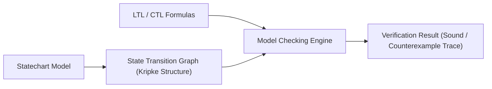
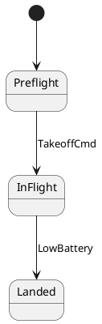

# Formal Model Checking (LTL & CTL)

`fsmc` includes a verification engine that checks statechart safety, liveness, and reachability properties against the state machine's transition graph (Kripke structure) prior to code generation.

---

## Verification Principles

Model checking systematically explores reachable state configurations and possible transition sequences to evaluate formal specifications:



- **Safety Properties**: Verify that hazardous states or invalid state combinations are never reachable.
- **Liveness Properties**: Verify that designated recovery or terminal states are guaranteed to be reached following trigger events.
- **Deadlock and Dead-State Detection**: Identifies states with no legal outgoing transitions or unreachable branches.


---

## Supported Temporal Logic Operators

The verification engine supports Linear Temporal Logic (LTL) and Computation Tree Logic (CTL) formulas:

| Operator | Syntax | Semantics | Aerospace / Mission Example |
| :--- | :--- | :--- | :--- |
| **Globally (Always)** | `G (P)` | Property `P` holds in every reachable state. | **Safety Invariant**: `G !(MotorsArmed && ChargingBattery)` |
| **Finally (Eventually)**| `F (P)` | Property `P` is guaranteed to be reached. | **Mission Completion**: `F (MissionAccomplished)` |
| **Response (Leadsto)** | `G (P -> F Q)` | Whenever trigger `P` occurs, state `Q` is eventually reached. | **Fail-Safe Response**: `G (LowBattery -> F SafeLanding)` |
| **Next State** | `X (P)` | Property `P` holds in the immediate next step. | **Sequence Order**: `G (DisarmCmd -> X MotorsStopped)` |
| **Until** | `P U Q` | Property `P` holds continuously until `Q` becomes true. | **Holding Pattern**: `Preflight U SystemReady` |
| **Mutual Exclusion** | `G (!(A && B))`| States `A` and `B` can never be simultaneously active. | **Orthogonal Safety**: `G (!(EmergencyStop && InMotion))` |


---

## Specifying Properties in Models

### 1. In OMG SysML v2
```sysml
package FlightControl {
    state def AircraftMission {
        entry; then Preflight;
        state Preflight;
        state InFlight;
        state Landed;

        // Formal Safety Property: Mutual exclusion between Preflight and InFlight
        @fsm:property DisjointFlight = "G (!(Preflight && InFlight))";

        // Formal Liveness Property: Low battery always eventually leads to Landed
        @fsm:property SafeLandingOnLowBattery = "G (LowBattery -> F Landed)";
    }
}
```

### 2. In PlantUML / Mermaid


---

## Running Verification via CLI

Execute the model checker against your model:

```bash
fsmc -i flight_mission.sysml --verify
```

### Passing Output
```text
[INFO] Parsed 8 states, 12 transitions from flight_mission.sysml
[INFO] Model Checking started:
  [PASS] Property 'DisjointFlight': G (!(Preflight && InFlight))
  [PASS] Property 'SafeLandingOnLowBattery': G (LowBattery -> F Landed)
  [PASS] Deadlock Freedom: No terminal unhandled dead-end states detected
  [PASS] Unreachable State Analysis: 0 dead states found
[SUCCESS] All 4 formal verification properties SOUND and VERIFIED.
```

### Diagnosing Counterexample Violations
If a temporal formula fails, `fsmc` prints the exact counterexample trace showing the execution path leading to the violation:

```text
[ERROR] Formal Property 'SafeLandingOnLowBattery' VIOLATED!
Counterexample Trace:
  Step 1: State: InFlight (batteryLevel = 100)
  Step 2: Event: LowBattery
  Step 3: Transition: InFlight -> HoverPause (Deadlock cycle: No outgoing transition from HoverPause to Landed)
```

---

## nuXmv / SMV Formal Logic Export

You can export the formal Kripke transition model directly to nuXmv / SMV for external theorem provers and formal certification packages:

```bash
# Export formal SMV specification
fsmc -i flight_mission.sysml --export smv -o flight_model.smv
```
