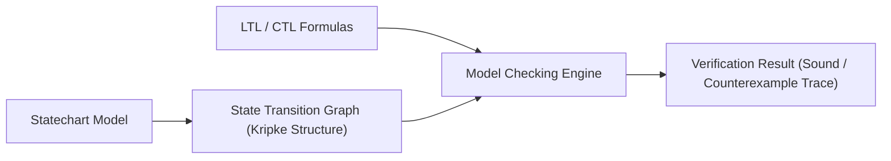
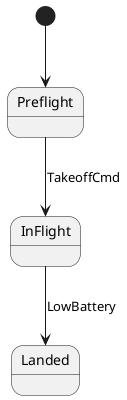

# Formal Model Checking (LTL & CTL)

`fsmc` includes a verification engine that checks statechart safety, liveness, and reachability properties against the state machine's transition graph (Kripke structure) prior to code generation.

---

## Verification Principles

Model checking systematically explores reachable state configurations and possible transition sequences to evaluate formal specifications:



- **Safety Properties**: Verify that hazardous states or invalid state combinations are never reachable.
- **Liveness Properties**: Verify that designated recovery or terminal states are guaranteed to be reached following trigger events.
- **Deadlock and Dead-State Detection**: Identifies states with no legal outgoing transitions or unreachable branches.


---

## Supported Temporal Logic Operators

The verification engine evaluates **Linear Temporal Logic (LTL)** and **Computation Tree Logic (CTL)** formulas over the state machine's transition graph.

### Summary Reference Table

| Operator | Formula Syntax | Description | Example Pattern |
| :--- | :--- | :--- | :--- |
| **Globally (Always)** | `G (P)` | Property `P` must hold in **every** reachable state. | `G !(Armed && Charging)` |
| **Finally (Eventually)** | `F (P)` | Property `P` is guaranteed to become true **at least once** in future execution. | `F (SystemReady)` |
| **Response (Leadsto)** | `G (P -> F Q)` | Whenever stimulus `P` occurs, response `Q` is **guaranteed** to eventually follow. | `G (FaultDetected -> F SafeHold)` |
| **Next State** | `X (P)` | Property `P` must hold in the **immediate next** cycle step. | `G (DisarmCmd -> X Disarmed)` |
| **Until** | `P U Q` | Condition `P` remains true **continuously** until `Q` becomes true. | `Preheating U TargetTempReached` |
| **Mutual Exclusion** | `G (!(A && B))` | States or conditions `A` and `B` can **never** be active simultaneously. | `G (!(EStop && MotorsActive))` |

---

### How to Use Temporal Operators: Practical Recipes

#### 1. `G (P)` — Safety Invariants ("Bad things never happen")
Use `G` (Globally) when a condition must **always** remain true throughout the entire lifecycle of the state machine.

- **Mutual Exclusion**: Proving two orthogonal or conflicting states never activate at the same time:
  ```sysml
  @fsm:property DisjointFlight = "G (!(Preflight && InFlight))";
  ```
- **Hazard Prevention**: Ensuring actuators are disabled during sensitive operations:
  ```sysml
  @fsm:property NoDriveWhileCharging = "G (Charging -> !MotorsEnabled)";
  ```

#### 2. `F (P)` — Eventual Completion ("Good things eventually happen")
Use `F` (Finally) to prove that the state machine does not get stuck in a bootloader or infinite initialization trap and eventually reaches operational status.

- **Initialization Guarantee**:
  ```sysml
  @fsm:property BootCompletes = "F (Operational)";
  ```

#### 3. `G (P -> F Q)` — Response / Leadsto (The Core System Pattern)
This is the **most frequently used pattern in reactive systems**. It proves that every time an event, trigger, or fault `P` occurs, the state machine is guaranteed to eventually transition to the handling state `Q`.

- **Fail-Safe Response**: Low battery must always lead to a safe landing state:
  ```sysml
  @fsm:property LowBatteryRecovery = "G (LowBattery -> F Landed)";
  ```
- **Command Acknowledgment**: When a reset command is received, the system must eventually return to Standby:
  ```sysml
  @fsm:property ResetGuaranteed = "G (EvReset -> F Standby)";
  ```

#### 4. `X (P)` — Immediate Step Transition
Use `X` (Next) to verify the behavior of the single cycle immediately following an event.

- **Immediate Interlock**: Triggering an emergency stop must disarm the system on the very next step:
  ```sysml
  @fsm:property InstantDisarm = "G (EmergencyStop -> X Disarmed)";
  ```

#### 5. `P U Q` — Holding Conditions (Until)
Use `U` (Until) when a state machine must remain in a holding mode `P` up until a specific completion threshold `Q` is met.

- **Pre-Flight Check**: System remains in `Preflight` until `CalibrationComplete` occurs:
  ```sysml
  @fsm:property HoldUntilCalibrated = "Preflight U CalibrationComplete";
  ```

---

### Combining Logic Operators

You can compose complex multi-condition specifications using standard boolean operators:
- `&&` (Logical AND)
- `||` (Logical OR)
- `!` (Logical NOT)
- `->` (Logical Implication: *"if P then Q"*)

**Example Multi-Condition Safety Property**:
```sysml
// If a critical sensor fault occurs while in HighSpeed mode, the machine must eventually enter EmergencyBrake
@fsm:property CriticalFaultBrake = "G ((SensorFault && HighSpeed) -> F EmergencyBrake)";
```

---

### Mission-Critical Formal Safety Patterns

In safety-critical and high-integrity statecharts, formal specifications typically express canonical verification patterns:

| Safety Archetype | Informal Requirement | Canonical LTL Template | Concrete `fsmc` Example |
| :--- | :--- | :--- | :--- |
| **Deadlock Freedom** | The machine can never enter an unintended trap state without escape transitions. | `G (!Deadlock)` | Built-in analysis (`fsmc verify`) |
| **Hazard Invariant** | Dangerous actuator states can never occur when safety interlocks are triggered. | `G (HazardTrigger -> SafeState)` | `G (DoorOpen -> !Spin)` |
| **Fault Recovery (Response)** | Every detected fault condition must deterministically trigger safe degraded recovery. | `G (Fault -> F RecoveryState)` | `G (LowBattery -> F Landed)` |
| **Strict Ordering (Precedence)** | A critical high-energy state can only be activated if preceded by complete self-test. | `!ArmState U SelfTestPassed` | `!Armed U CalibrationDone` |
| **Reversibility / Home Reachability** | From any operational failure, the system can always return to a standby state. | `G (F Standby)` | `G (F Idle)` |

---

## Specifying Properties in Models

### 1. In OMG SysML v2
```sysml
package FlightControl {
    state def AircraftMission {
        entry; then Preflight;
        state Preflight;
        state InFlight;
        state Landed;

        // Formal Safety Property: Mutual exclusion between Preflight and InFlight
        @fsm:property DisjointFlight = "G (!(Preflight && InFlight))";

        // Formal Liveness Property: Low battery always eventually leads to Landed
        @fsm:property SafeLandingOnLowBattery = "G (LowBattery -> F Landed)";
    }
}
```

### 2. In PlantUML / Mermaid


---

## Running Verification via CLI

Execute the model checker against your model:

```bash
fsmc -i flight_mission.sysml --verify
```

### Passing Output
```text
[INFO] Parsed 8 states, 12 transitions from flight_mission.sysml
[INFO] Model Checking started:
  [PASS] Property 'DisjointFlight': G (!(Preflight && InFlight))
  [PASS] Property 'SafeLandingOnLowBattery': G (LowBattery -> F Landed)
  [PASS] Deadlock Freedom: No terminal unhandled dead-end states detected
  [PASS] Unreachable State Analysis: 0 dead states found
[SUCCESS] All 4 formal verification properties SOUND and VERIFIED.
```

### Diagnosing Counterexample Violations

When a formal property fails, `fsmc` does not simply report a failure—it outputs a **step-by-step counterexample trace** pinpointing the exact transition sequence and data values that trigger the breach:

#### Case A: Safety Invariant Violation (Finite Trace)

A safety violation demonstrates a finite sequence of valid transitions leading to a forbidden state configuration:

=== "Flawed Model (Triggers E0401)"
    ```sysml
    package SystemSafety {
        state def PowerUnit {
            state Disconnected;
            state Charging;
            state HighLoad;

            // Invariant: System must never be HighLoad while Charging
            @fsm:property SafeOperation = "G !(Charging && HighLoad)";

            entry; then Disconnected;
            
            // Flaw: Unconditional transition into HighLoad while in parallel Charging region
            transition plug_in first Disconnected then Charging;
            transition start_load first Charging then HighLoad; // Bug: Transitions to HighLoad without disconnecting
        }
    }
    ```

=== "Compiler Counterexample Output"
    ```text
    error[E0401]: Formal safety property 'SafeOperation' violated!
      --> power_unit.sysml:8:9
       |
     8 |         @fsm:property SafeOperation = "G !(Charging && HighLoad)";
       |         ^^^^^^^^^^^^^^^^^^^^^^^^^^^^^^^^^^^^^^^^^^^^^^^^^^^^^^^^ Invariant breached
       |
    Counterexample Execution Trace:
      [Step 1] Initial state: Disconnected
      [Step 2] Event injected: EvPlugIn
      [Step 3] Transition fired: Disconnected -> Charging
      [Step 4] Event injected: EvStartLoad
      [Step 5] Transition fired: Charging -> HighLoad (while charging active)
      [Result] State configuration violates invariant 'G !(Charging && HighLoad)'!
    ```

=== "Resolved Model (Clean)"
    ```sysml
    package SystemSafety {
        state def PowerUnit {
            state Disconnected;
            state Charging;
            state HighLoad;

            @fsm:property SafeOperation = "G !(Charging && HighLoad)";

            entry; then Disconnected;
            
            transition plug_in first Disconnected then Charging;
            // Fixed: must transition through Disconnected before enabling HighLoad
            transition stop_and_load first Charging accept EvStartLoad then Disconnected;
            transition enable_load   first Disconnected accept EvEnableLoad then HighLoad;
        }
    }
    ```

#### Case B: Liveness / Response Violation (Infinite Lasso Cycle)

A liveness violation (`G (P -> F Q)`) occurs when the system can enter an infinite loop (a "lasso cycle") where the required response `Q` is starved and never reached:

=== "Flawed Model with Livelock (Triggers E0402)"
    ```sysml
    package FlightSystem {
        state def MissionController {
            state InFlight;
            state HoldingPattern;
            state Landed;

            // Liveness: Low battery must always eventually lead to Landed
            @fsm:property SafeLanding = "G (LowBattery -> F Landed)";

            transition on_low_bat first InFlight accept LowBattery then HoldingPattern;
            
            // Flaw: HoldingPattern loops indefinitely on EvHoldTick, with no path to Landed!
            transition hold_loop first HoldingPattern accept EvHoldTick then HoldingPattern;
        }
    }
    ```

=== "Compiler Counterexample Output"
    ```text
    error[E0402]: Formal liveness property 'SafeLanding' violated!
      --> mission.sysml:8:9
       |
     8 |         @fsm:property SafeLanding = "G (LowBattery -> F Landed)";
       |         ^^^^^^^^^^^^^^^^^^^^^^^^^^^^^^^^^^^^^^^^^^^^^^^^^^^^^^^^ Liveness starved
       |
    Counterexample Lasso Execution Trace:
      Prefix Path:
        [Step 1] State: InFlight
        [Step 2] Event: LowBattery
        [Step 3] Transition fired: InFlight -> HoldingPattern
      Infinite Cycle Loop (Lasso):
        ┌─► [Step 4] State: HoldingPattern
        │   [Step 5] Event: EvHoldTick -> Transition fired: HoldingPattern -> HoldingPattern
        └── (Cycle repeats indefinitely: 'Landed' is never reachable from this loop!)
    ```

=== "Resolved Model (Clean)"
    ```sysml
    package FlightSystem {
        state def MissionController {
            state InFlight;
            state HoldingPattern;
            state Landed;

            @fsm:property SafeLanding = "G (LowBattery -> F Landed)";

            transition on_low_bat first InFlight accept LowBattery then HoldingPattern;
            
            // Fixed: HoldingPattern has guaranteed exit path to Landed
            transition hold_loop first HoldingPattern accept EvHoldTick if in.holding_time < 5.0 then HoldingPattern;
            transition descend   first HoldingPattern if in.holding_time >= 5.0 then Landed;
        }
    }
    ```

---

## CLI Formal Verification with `fsmc verify` (v0.5.0+)

Starting in **`v0.5.0`**, `fsmc` provides first-class, standalone model checking directly via the command line through the `verify` sub-command:

```bash
fsmc verify <model_file> [options]
```

### Options and Flags

| Option | Argument | Description | Default |
| :--- | :--- | :--- | :--- |
| `--engine` | `auto`, `nuxmv` | Specifies the underlying verification engine. `auto` uses the internal graph model checker. | `auto` |
| `--ltl` | `"<formula>"` | Injects an ad-hoc LTL formula for verification on the input model. | `""` |
| `--ctl` | `"<formula>"` | Injects an ad-hoc CTL formula for verification on the input model. | `""` |

### 1. Verifying Structural Soundness and Built-in Invariants

```bash
fsmc verify examples/connection_manager/connection.smv
```

**Output:**
```text
============================================================================
 Formal Model Verification Report: Connection
============================================================================
 Input File:       examples/connection_manager/connection.smv
 States:           4
 Total Events:     8
 Transitions:      11
 Choice Nodes:     0
 Deferred Triggers:0
----------------------------------------------------------------------------
 Diagnostics:
  (No warnings or errors detected. Model is formally sound!)
----------------------------------------------------------------------------
 Verification Status: PASSED (Model Sound & Properties Verified)
============================================================================
```

### 2. Ad-hoc LTL Verification with Execution Counterexample Trace

When verifying custom temporal properties from the CLI, any violation generates an exact state-by-state counterexample execution trace:

```bash
fsmc verify examples/connection_manager/connection.smv \
    --ltl "G (State == Closed -> F State == Established)"
```

**Output:**
```text
error[E_MODEL_CHECK_VIOLATION]: Formal property 'cli_ltl_property' [Safety] VIOLATED: Invariant 'G (State == Closed -> F State == Established)' evaluated to false in state 'Suspended'
Counterexample execution trace:
    Step 0: State 'Disconnected' --[ConnectCmd if ((HasNetworkGuard && HasValidCredentialsGuard))]--> (Initial active state)
    Step 1: State 'Connecting' --[HandshakeOkEvent]--> (Normal transition execution)
    Step 2: State 'Connected' --[NetworkDegradedEvent]--> (Normal transition execution)
    Step 3: State 'Suspended' (Invariant 'G (State == Closed -> F State == Established)' evaluated to false in state 'Suspended')
```

---

## nuXmv / SMV Formal Logic Export

You can export the transition model directly into canonical SMV logic for external verification tools such as nuXmv:

```bash
# Export formal SMV specification
fsmc -i flight_mission.sysml --export smv -o flight_model.smv

# Execute nuXmv externally (optional)
nuxmv flight_model.smv
```
