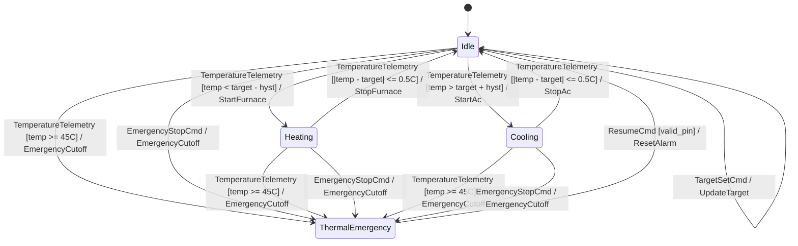

# Showcase 00: Pure Modern C++20 Standalone IoT Thermostat

A hands-on, realistic demonstration of building a **zero-overhead, zero-heap finite state machine** purely in Modern C++20 without external diagram compilers or code generators.

---

## Architectural Highlights

1. **Pure C++ Header-Only Engine**:
   - Built directly with `fsm::transition_table<fsm::transition<Source, Event, Target, Guard, Action>...>`.
   - Requires zero build-time generators—compile directly against `include/fsm/backend/cpp/runtime/fsm.hpp` or the single-header runtime.
2. **Strongly-Typed Event Payloads**:
   - Events carry rich telemetry (`TemperatureTelemetry{ current_temp, humidity, sensor_id }`) and commands (`TargetSetCmd{ target_temp, eco_mode }`).
   - Guards and Actions consume these payloads alongside discrete registers without manual casting or unpacking.
3. **Zero Dynamic Allocation (0 Bytes Heap)**:
   - State variant, transitions, and context structures reside strictly on the stack or within the caller's memory model.
4. **Exhaustive Dispatch Inspection**:
   - Demonstrates evaluation of `dispatch_result` (`is_success()`, `is_guard_rejected()`, `is_unhandled()`), providing safety contracts and actionable error diagnostics.

---

## State Diagram Concept



---

## Compiling and Running

```bash
# Build with CMake
cmake --build build --target standalone_iot_controller_example

# Run directly
./build/examples/standalone_iot_controller_example
```
