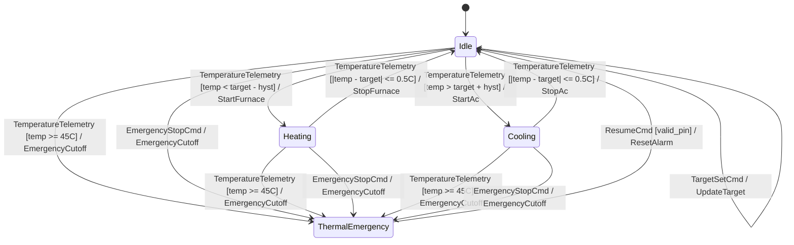

# Showcase 00: Pure Modern C++20 Standalone IoT Thermostat

A hands-on, realistic demonstration of building a **zero-overhead, zero-heap finite state machine** purely in Modern C++20 without external diagram compilers or code generators.

---

## ⚡ The Minimal Mental Model (15 Seconds)

Before diving into the full HVAC thermostat implementation, this is the foundational paradigm of the `fsmc` C++ runtime:

```cpp
#include <fsm.hpp>

// 1. Declare States & Events as lightweight zero-cost structs
struct Off {};
struct On  {};
struct ToggleCmd {};

// 2. Define Transition Table: <Source, Event, Target, [Action], [Guard]>
using Table = fsm::transition_table<
    fsm::transition<Off, ToggleCmd, On>,
    fsm::transition<On,  ToggleCmd, Off>
>;

// 3. Instantiate and Dispatch (0 bytes heap allocated)
fsm::fsm<Table> machine;
auto result = machine.dispatch(ToggleCmd{});
assert(result.is_success() && machine.is_in_state<On>());
```

---

## Architectural Highlights

1. **Pure C++ Header-Only Engine**:
   - Built directly with `fsm::transition_table<fsm::transition<Source, Event, Target, Guard, Action>...>`.
   - Requires zero build-time generators—compile directly against `include/fsm/fsm.hpp` or the single-header standalone runtime.
2. **Strongly-Typed Event Payloads**:
   - Events carry rich telemetry (`TemperatureTelemetry{ current_temp, humidity, sensor_id }`) and commands (`TargetSetCmd{ target_temp, eco_mode }`).
   - Guards and Actions consume these payloads alongside discrete registers without manual casting or unpacking.
3. **Zero Dynamic Allocation (0 Bytes Heap)**:
   - State variant, transitions, and context structures reside strictly on the stack or within the caller's memory model.
4. **Exhaustive Dispatch Inspection**:
   - Demonstrates evaluation of `dispatch_result` (`is_success()`, `is_guard_rejected()`, `is_unhandled()`), providing safety contracts and actionable error diagnostics.

---

## State Diagram Concept


```mermaid
stateDiagram-v2
    [*] --> Idle
    Idle --> Heating : TemperatureTelemetry [temp < target - hyst] / StartFurnace
    Idle --> Cooling : TemperatureTelemetry [temp > target + hyst] / StartAc
    Idle --> ThermalEmergency : TemperatureTelemetry [temp >= 45C] / EmergencyCutoff
    Idle --> Idle : TargetSetCmd / UpdateTarget
    Idle --> ThermalEmergency : EmergencyStopCmd / EmergencyCutoff

    Heating --> Idle : TemperatureTelemetry [|temp - target| <= 0.5C] / StopFurnace
    Heating --> ThermalEmergency : TemperatureTelemetry [temp >= 45C] / EmergencyCutoff
    Heating --> ThermalEmergency : EmergencyStopCmd / EmergencyCutoff

    Cooling --> Idle : TemperatureTelemetry [|temp - target| <= 0.5C] / StopAc
    Cooling --> ThermalEmergency : TemperatureTelemetry [temp >= 45C] / EmergencyCutoff
    Cooling --> ThermalEmergency : EmergencyStopCmd / EmergencyCutoff

    ThermalEmergency --> Idle : ResumeCmd [valid_pin] / ResetAlarm
```

---

## Compiling and Running

### Option 1: Via CMake (Project Build Tree)

```bash
# From the repository root:
cmake -B build -S . -DCMAKE_BUILD_TYPE=Release
cmake --build build --target standalone_iot_controller_example

# Run the executable:
./build/bin/standalone_iot_controller_example
```

### Option 2: Direct Command Line (No CMake)

Since Showcase 00 requires no code generator, you can compile it directly with any C++20 compiler:

```bash
# From examples/00_standalone_iot_controller/:
g++ -std=c++20 -O2 -Wall -Wextra -I../../include main.cpp -o iot_thermostat
./iot_thermostat
```
