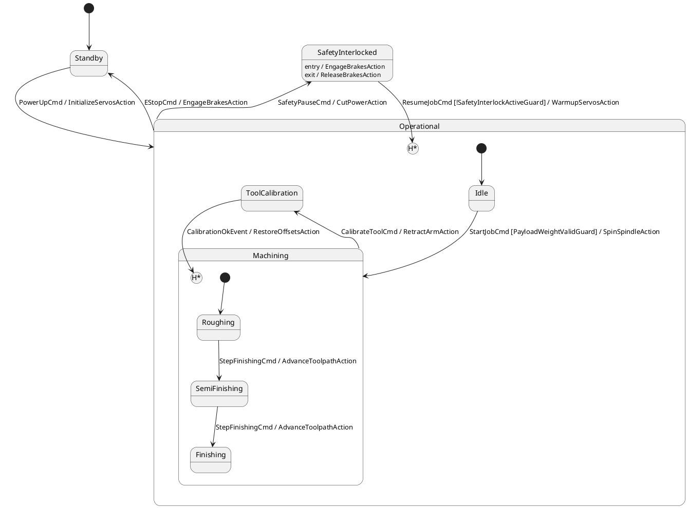

# 6-DOF Industrial Robotic Tool Sequencer

## Overview
This example models a safety-critical 6-DOF industrial robotic arm and CNC machining toolhead. It demonstrates advanced statechart semantics including multi-level deep history (`[H*]`), nested compound states (`Operational` and `Machining`), safety interlock pausing with boundary action fusion (`EngageBrakesAction` / `ReleaseBrakesAction`), tool calibration submachine interruption, and typed Model-Based Systems Engineering (MBSE) input/output ports with physical range contracts.

## Diagram/Model
The state machine is formally modeled in both OMG SysML v2 (`robotic_arm.sysml`) and annotated PlantUML (`robotic_arm.puml`):



## Quickstart CLI

Inspect model metrics and formal intermediate representation:
```bash
fsm-opt examples/02_advanced_semantics/robotic_arm_sequencer/robotic_arm.puml --metrics
```

Run history lowering and optimization passes to inspect lowered shadow registers:
```bash
fsm-opt examples/02_advanced_semantics/robotic_arm_sequencer/robotic_arm.puml \
    --passes=history-lowering,boundary-action-fusion,dead-state-pruning \
    --emit-ir
```

Generate zero-allocation standalone C++20 code:
```bash
fsmc examples/02_advanced_semantics/robotic_arm_sequencer/robotic_arm.puml \
    --c++20 --standalone --namespace robotics \
    --allow-diagram-codegen -o robotic_arm_fsm.hpp
```

Compile and run the executable verification suite:
```bash
g++ -std=c++20 -O2 \
    -I. -I../../../include \
    main.cpp -o robotic_arm_runner
./robotic_arm_runner
```

## Key Passes Demonstrated

| Middle-End Pass | Role in Pipeline | Architectural Effect |
| :--- | :--- | :--- |
| `history-lowering` | Pass 14 / Canonicalization | Synthesizes hidden shadow state variables tracking nested active substates (`Machining`, `Operational`) and expands re-entry transitions with deterministic conditional guards (`history_is<...>`). |
| `boundary-action-fusion` | Pass 16 / Normalization | Merges composite state `entry` and `exit` actions into external transition sequences, ensuring strict atomic execution ordering across compound boundaries. |
| `dead-state-pruning` | Pass 18 / Optimization | Traverses reachability graphs from the root initial state (`Standby`), validating all paths and eliminating dead subgraphs. |
| `action-guard-type-check` | Pass 02 / Semantic Validation | Enforces MBSE port contracts and bounds (`payload_weight_kg in [0, 35]`, `motor_torque_nm in [0, 250]`). |

## Expected Output

Running `robotic_arm_runner` executes the full hardware simulation cycle:

```text
================================================================================
 FSMC SHOWCASE 02: 6-DOF ROBOTIC ARM TOOL SEQUENCER
================================================================================
  [MBSE CONTRACTS] Input and Output port range constraints verified: OK
  [STEP] Initial Power-On State                 --> Current State: Standby

--- Scenario 1: Arm Initialization & Standby to Operational ---
  [SERVO DRIVER] 6-Axis AC brushless servomotors energized; brakes uncoupled
  [STEP] Dispatched PowerUpCmd                  --> Current State: Idle

--- Scenario 2: Tool Engagement & Nested Roughing Phase ---
  [SPINDLE] High-speed spindle spinning at 15,000 RPM with flood coolant
  [STEP] Dispatched StartJobCmd                 --> Current State: Roughing

--- Scenario 3: Advancing CNC Pass (Roughing -> SemiFinishing) ---
  [CNC TRAJECTORY] Interpolator advanced to pass #1
  [STEP] Dispatched StepFinishingCmd (1)        --> Current State: SemiFinishing

--- Scenario 4: Safety Curtain Breach -> SafetyInterlocked ---
  [SAFETY INTERLOCK] Physical barrier light curtain breached! Power cut!
  [SAFETY BRAKES] Fail-safe spring electromagnetic brakes clamped
  [STEP] Dispatched SafetyPauseCmd              --> Current State: SafetyInterlocked

--- Scenario 5: Safety Cleared & Deep History Restoration [H*] ---
  [SAFETY RECOVERY] Interlock cleared; releasing axis brakes
  [SERVO WARMUP] Re-synchronizing optical encoders; verifying zero-drift
  [STEP] Dispatched ResumeJobCmd -> Restored [H*]--> Current State: SemiFinishing
  [DEEP HISTORY OK] Verified: Arm restored directly to nested substate 'SemiFinishing'!

--- Scenario 6: Laser Tool Calibration & History Re-entry ---
  [CALIBRATION] Arm safely retracted along tool Z-axis to laser sensor
  [STEP] Dispatched CalibrateToolCmd            --> Current State: ToolCalibration
  [CALIBRATION] Tool Center Point (TCP) kinematics offset compensation applied
  [STEP] Dispatched CalibrationOkEvent -> Restored [H*] --> Current State: SemiFinishing

================================================================================
 ALL ROBOTIC SEQUENCER TESTS PASSED (100% SUCCESS)
================================================================================
```
