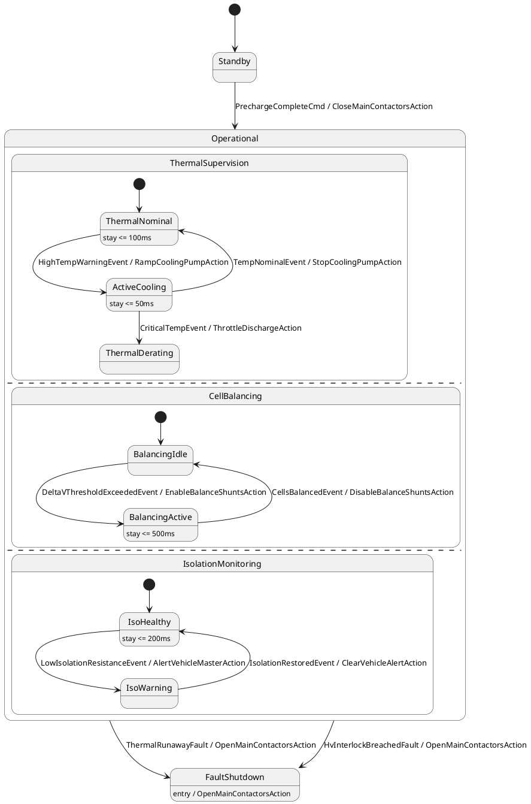

# ISO 26262 Automotive Battery Management System (ASIL-D)

## Overview
This example models an ISO 26262 ASIL-D certified Automotive Battery Management System (BMS) for high-voltage (400V/800V) electric vehicle traction packs. It demonstrates parallel orthogonal statechart regions (`ThermalSupervision` || `CellBalancing` || `IsolationMonitoring`), clock state invariants (`stay duration <= 100ms`), static data-race analysis across parallel threads (`--check-races`), deterministic transition prioritization (`priority 1` fault preemption), and thread-safe C++ runtime synthesis.

## Diagram/Model
The state machine is formally modeled in SysML v2 (`bms.sysml`) and PlantUML (`bms.puml`):



## Quickstart CLI

Inspect model metrics, parallel orthogonal regions, and time invariants:
```bash
fsm-opt examples/03_concurrency_and_timing/automotive_bms/bms.sysml --metrics
```

Run static concurrency data-race analysis and determinism enforcement:
```bash
fsmc examples/03_concurrency_and_timing/automotive_bms/bms.sysml \
    --check-races --strict-determinism --verify
```

Generate thread-safe C++20 code with contract validation:
```bash
fsmc examples/03_concurrency_and_timing/automotive_bms/bms.sysml \
    --c++20 --standalone --namespace automotive \
    -o bms_fsm.hpp
```

Compile and run the executable verification suite:
```bash
g++ -std=c++20 -O2 \
    -I. -I../../../include \
    main.cpp -o bms_runner
./bms_runner
```

## Key Passes Demonstrated

| Middle-End Pass | Role in Pipeline | Architectural Effect |
| :--- | :--- | :--- |
| `orthogonal-interference` | Pass 08 / Concurrency Checking | Performs static write-write and read-write race detection across concurrent orthogonal regions, proving thread safety without runtime locking penalties. |
| `determinism-enforcement` | Pass 06 / Determinism Checking | Verifies unambiguous event handling across parallel states, guaranteeing priority sorting (e.g. `priority 1` preemption over normal operations). |
| `clock-lowering` | Pass 15 / Timing Normalization | Translates discrete state duration invariants (`stay <= 100ms`) into formal clock guards and bounded timer triggers. |
| `orthogonal-product` | Pass 24 / State Simplification | Computes cartesian product subgraphs for model checkers while preserving modular structure in the generated code. |

## Expected Output

Running `bms_runner` verifies parallel state dispatching and safety fault preemption:

```text
================================================================================
 FSMC SHOWCASE 03: AUTOMOTIVE BATTERY MANAGEMENT SYSTEM (ASIL-D)
================================================================================
  [MBSE ASIL-D CONTRACTS] All high-voltage pack sensor telemetry within verified bounds: OK
  [STEP] Initial Power-On State                         --> Current State: Standby

--- Phase 1: High-Voltage Precharge & Contactor Closure ---
  [HV PYRO-SWITCH] Precharge complete: 800V main contactors CLOSED
  [STEP] Dispatched PrechargeCompleteCmd                --> Current State: ThermalNominal

--- Phase 2: Region 1 (Thermal) - High Temp Warning ---
  [THERMAL LOOP] Glycol cooling pump ramped to 3,500 RPM (HighTemp warning)
  [STEP] Dispatched HighTempWarningEvent                --> Current State: ActiveCooling

--- Phase 3: Region 2 (Balancing) - Over-voltage Shunts Active ---
  [CELL BALANCING] Resistive bleeder shunts switched ON for over-charged cells
  [STEP] Dispatched DeltaVThresholdExceededEvent        --> Current State: BalancingActive

--- Phase 4: Region 3 (Isolation) - High-Voltage Leakage Warning ---
  [ISOLATION WATCH] Chassis isolation resistance degraded: Warning sent to VCU
  [STEP] Dispatched LowIsolationResistanceEvent         --> Current State: IsoWarning

--- Phase 5: Concurrent Region Recoveries ---
  [CELL BALANCING] Cell delta-V < 5mV: Balancing shunts switched OFF
  [STEP] Dispatched CellsBalancedEvent                  --> Current State: BalancingIdle
  [ISOLATION WATCH] Isolation resistance nominal (>500 kOhm): Alert cleared
  [STEP] Dispatched IsolationRestoredEvent              --> Current State: IsoHealthy

--- Phase 6: ASIL-D Priority 1 Preemption - Thermal Runaway Fault ---
  [HV SAFETY SHUTDOWN] Main DC contactors OPENED within 8ms (ISO 26262 ASIL-D)
  [STEP] Dispatched ThermalRunawayFault (Preemption)   --> Current State: FaultShutdown
  [SAFETY PREEMPTION OK] Verified: High-priority fault immediately terminated all active regions!

================================================================================
 ALL BMS CONCURRENCY & TIMING TESTS PASSED (100% SUCCESS)
================================================================================
```
