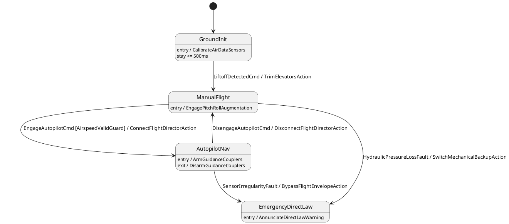

# DO-178C Level A Flight Control Mode Manager

## Overview
This example models a safety-critical Fly-By-Wire (FBW) Primary Flight Computer (PFC) mode sequencer operating under DO-178C Level A and DO-333 formal methods guidelines. It demonstrates formal temporal logic verification (LTL/CTL properties via `@fsm:property`), automated Requirement Traceability Matrix (RTM) generation (`--req-audit` and `--rtm-output`), formal model export to nuXmv / SMV symbolic model checking (`--emit-smv`), SMT guard satisfiability, and fail-safe reconfiguration paths (`EmergencyDirectLaw`).

## Diagram/Model
The state machine is modeled in OMG SysML v2 (`fms.sysml`) and PlantUML (`fms.puml`):



## Quickstart CLI

Verify all formal LTL temporal properties and safety invariants:
```bash
fsmc examples/04_formal_verification/flight_control_modes/fms.sysml --verify
```

Audit DO-178C requirement traceability and export RTM matrix to JSON:
```bash
fsmc examples/04_formal_verification/flight_control_modes/fms.sysml \
    --req-audit \
    --rtm-output rtm.json --rtm-format json \
    -o fms_fsm.hpp
```

Export canonical nuXmv / SMV formal model checking specification:
```bash
fsm-opt examples/04_formal_verification/flight_control_modes/fms.sysml \
    --emit-smv -o fms.smv
```

Compile and run the executable verification suite:
```bash
g++ -std=c++20 -O2 \
    -I. -I../../../include \
    main.cpp -o fms_runner
./fms_runner
```

## Key Passes Demonstrated

| Middle-End Pass | Role in Pipeline | Architectural Effect |
| :--- | :--- | :--- |
| `model-checking-engine` | Pass 28 / Formal Verification | Evaluates LTL formulas (`G !(ManualFlight && AutopilotNav)`, `G (SensorFault -> F DirectLaw)`) against Kripke structures synthesized from the IR. |
| `rtm-traceability-audit` | Pass 03 / Compliance Analysis | Scans `@fsm:req` annotations and SysML v2 `satisfy requirement` links, flagging untraced states or unverified properties. |
| `guard-simplification` | Pass 07 / Logic Minimization | Applies algebraic boolean reductions and SMT satisfiability checks to eliminate dead guard branches (`AirspeedValidGuard`). |
| `action-guard-type-check` | Pass 02 / Semantic Validation | Validates typed MBSE contracts on physical aerospace telemetry (`airspeed_knots in [0, 600]`, `hydraulic_pressure_psi in [0, 3500]`). |

## Expected Output

Running `fsmc --verify` proves mathematical model soundness:

```text
============================================================================
 Formal Model Verification Report: FlightControlModeManager
============================================================================
 Input File:       examples/04_formal_verification/flight_control_modes/fms.sysml
 States:           4
 Total Events:     5
 Transitions:      5
 Choice Nodes:     0
 Deferred Triggers:0
----------------------------------------------------------------------------
 Formal Temporal Properties (3):
  [PASSED] AutopilotReachable (F AutopilotNav)
  [PASSED] FailsafeDirectLaw (G (SensorIrregularityFault -> F EmergencyDirectLaw))
  [PASSED] MutualExclusion (G !(ManualFlight && AutopilotNav))
----------------------------------------------------------------------------
 Verification Status: PASSED (Model Sound & Properties Verified)
============================================================================
```

Executing `fms_runner` verifies nominal autopilot transitions and emergency reconfiguration:

```text
================================================================================
 FSMC SHOWCASE 04: DO-178C LEVEL A FLIGHT CONTROL MODE MANAGER
================================================================================
  [MBSE AEROSPACE CONTRACTS] Air data & hydraulic pressure sensor contracts verified: OK
  [STEP] Initial Preflight State                --> Current State: GroundInit

--- Phase 1: Runway Liftoff & Transition to Manual Flight ---
  [FLIGHT CONTROLS] Horizontal stabilizer auto-trimmed to takeoff reference (+3.2 deg)
  [CONTROL LAWS] Normal Law flight envelope protection active (C* pitch rate / roll rate)
  [STEP] Dispatched LiftoffDetectedCmd          --> Current State: ManualFlight

--- Phase 2: Climb-Out & Autopilot Engagement ---
  [FLIGHT DIRECTOR] Primary flight display FD crossbars coupled to FMC navigation route
  [AUTOPILOT] Lateral (LNAV) and Vertical (VNAV) guidance couplers ARMED
  [STEP] Dispatched EngageAutopilotCmd          --> Current State: AutopilotNav

--- Phase 3: Pilot Sidestick Priority Takeover ---
  [FLIGHT DIRECTOR] Flight director decoupled; reverting to manual command bars
  [AUTOPILOT] Autopilot disengaged: pilot hand flying on sidestick
  [STEP] Dispatched DisengageAutopilotCmd       --> Current State: ManualFlight

--- Phase 4: Cruise Segment Re-engagement ---
  [FLIGHT DIRECTOR] Primary flight display FD crossbars coupled to FMC navigation route
  [AUTOPILOT] Lateral (LNAV) and Vertical (VNAV) guidance couplers ARMED
  [STEP] Dispatched EngageAutopilotCmd          --> Current State: AutopilotNav

--- Phase 5: Critical Sensor Discrepancy & Direct Law Fallback ---
  [RECONFIGURATION] Air-data inconsistency: Bypassing FCC high-alpha/bank angle limits
  [EICAS WARNING] DIRECT LAW: Flight envelope protections lost! Amber master caution!
  [STEP] Dispatched SensorIrregularityFault     --> Current State: EmergencyDirectLaw
  [FORMAL PROPERTY SAFE-04] Verified: Reconfiguration guarantees immediate Direct Law fallback!

================================================================================
 ALL FORMAL FLIGHT MODE VERIFICATION TESTS PASSED (100% SUCCESS)
================================================================================
```
