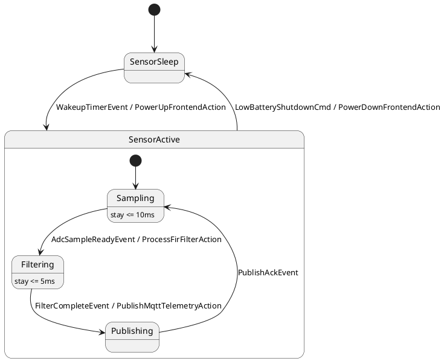

# Custom Compiler Toolchain, Unix Pipes & Pass Plugins

## Overview
This example demonstrates compiler pipeline extensibility and custom middle-end passes in `fsmc`. It models an ultra-low-power industrial sensor acquisition pipeline (sampling -> FIR filtering -> MQTT publishing). It illustrates how development teams can plug in external Unix linters and model filters using `--pipe-through` (e.g. strict MBSE port range checkers in Python) as well as compile dynamic C++ middle-end pass plugins (`.so`/`.dylib`) loaded at runtime via `--load-pass-plugin` into `fsm-opt` or `fsmc`.

## Diagram/Model
The state machine is modeled in OMG SysML v2 (`sensor_pipeline.sysml`) and PlantUML (`sensor_pipeline.puml`):



## Quickstart CLI

1. Run an external Unix pipe linter (Python script validating MBSE port bounds via stdin/stdout):
```bash
fsm-opt examples/05_custom_toolchain/plugin_and_pipeline/sensor_pipeline.sysml \
    --pipe-through="python3 examples/05_custom_toolchain/plugin_and_pipeline/scripts/strict_bounds_linter.py" \
    --metrics
```

2. Compile the dynamic C++ middle-end pass plugin:
```bash
g++ -std=c++20 -shared -fPIC \
    -Iinclude \
    examples/05_custom_toolchain/plugin_and_pipeline/src/naming_audit_pass_plugin.cpp \
    -o libnaming_audit_pass.so
```

3. Load the pass plugin dynamically into `fsm-opt` at runtime:
```bash
fsm-opt examples/05_custom_toolchain/plugin_and_pipeline/sensor_pipeline.sysml \
    --load-pass-plugin=./libnaming_audit_pass.so \
    --metrics
```

4. Combine both external filter and dynamic pass plugin in one compilation step:
```bash
fsm-opt examples/05_custom_toolchain/plugin_and_pipeline/sensor_pipeline.sysml \
    --load-pass-plugin=./libnaming_audit_pass.so \
    --pipe-through="python3 examples/05_custom_toolchain/plugin_and_pipeline/scripts/strict_bounds_linter.py" \
    --emit-ir -o sensor_pipeline.ir.json
```

5. Generate C++20 code, build, and run the verified sensor runner:
```bash
fsmc examples/05_custom_toolchain/plugin_and_pipeline/sensor_pipeline.sysml \
    --c++20 --standalone --namespace sensing \
    -o sensor_fsm.hpp

g++ -std=c++20 -O2 \
    -I. -I../../../include \
    main.cpp -o sensor_runner
./sensor_runner
```

## Key Passes Demonstrated

| Middle-End Pass | Role in Pipeline | Architectural Effect |
| :--- | :--- | :--- |
| `pipe-through` | Pass 30 / Pipeline Extension | Serializes current IR to JSON, streams to an external Unix process's standard input (`python3`), and ingests validated/mutated IR from standard output. |
| `naming-audit` (Plugin) | Dynamic C++ Plugin | Dynamically loaded via `dlopen`/`dlsym`, registers directly into `PassManager`, and checks PascalCase and snake_case conventions on all AST entities. |
| `timed-invariants-verifier` | Pass 15 / Timing Validation | Verifies discrete state duration bounds (`Sampling stay <= 10ms`, `Filtering stay <= 5ms`) against clock definitions. |
| `dead-state-pruning` | Pass 18 / Graph Optimization | Validates graph reachability from initial state (`SensorSleep`) through composite and compound subgraphs. |

## Expected Output

Executing the combined toolchain command produces custom linter diagnostics:

```text
[CUSTOM PLUGIN PASS] Running NamingAuditPass on model: 'SensorPipelineController'
  [AUDIT PASSED] Audited 5 states and 4 ports against engineering style guide: 100% compliant.
[PIPE-THROUGH LINTER] Auditing FSM Model 'SensorPipelineController' via external Unix filter...
  [PORT WARNING] Port 'dsp_active' is missing numerical range bounds!
  [PORT CONTRACT OK] Port 'filtered_value' has explicit range bounds: [0, 100]
  [PORT CONTRACT OK] Port 'raw_adc_microvolts' has explicit range bounds: [0, 3300000.0]
  [PORT CONTRACT OK] Port 'sample_rate_hz' has explicit range bounds: [1, 50000]
[PIPE-THROUGH OK] Successfully verified 3/4 MBSE port contracts.
note: Certified maximum micro-step bound per macro-step: 0 steps.
note: Successfully transformed IR via external filter: python3 examples/05_custom_toolchain/plugin_and_pipeline/scripts/strict_bounds_linter.py
```

Executing `sensor_runner` verifies sensor acquisition and teardown:

```text
================================================================================
 FSMC SHOWCASE 05: CUSTOM TOOLCHAIN, UNIX PIPES & PASS PLUGINS
================================================================================
  [MBSE CONTRACT CHECK] Input ADC telemetry & DSP output range constraints validated: OK
  [STEP] Initial Power-Down State               --> Current State: SensorSleep

--- Phase 1: Periodic Timer Wakeup & AFE Power-Up ---
  [HARDWARE/AFE] 24-bit Delta-Sigma ADC powered up; LDO reference stable at 3.3V
  [STEP] Dispatched WakeupTimerEvent            --> Current State: Sampling

--- Phase 2: DMA Buffer Ready & DSP FIR Filtering ---
  [DSP ACCELERATOR] Executed 64-tap symmetric FIR low-pass filter (sample #1)
  [STEP] Dispatched AdcSampleReadyEvent         --> Current State: Filtering

--- Phase 3: MQTT Telemetry Dispatch ---
  [MQTT/TLS CLIENT] Encrypted telemetry frame dispatched to broker topic 'sensors/v1/raw'
  [STEP] Dispatched FilterCompleteEvent         --> Current State: Publishing

--- Phase 4: Network Acknowledgment & Next Acquisition Loop ---
  [STEP] Dispatched PublishAckEvent             --> Current State: Sampling

--- Phase 5: Low-Battery Brownout Detection & Safe Sleep ---
  [HARDWARE/AFE] Analog frontend powered down into sub-microamp ultra-low power sleep
  [STEP] Dispatched LowBatteryShutdownCmd       --> Current State: SensorSleep
  [TEARDOWN VERIFIED] Sensor frontend completely isolated and in ultra-low-power mode.

================================================================================
 ALL TOOLCHAIN & SENSOR LIFECYCLE TESTS PASSED (100% SUCCESS)
================================================================================
```
