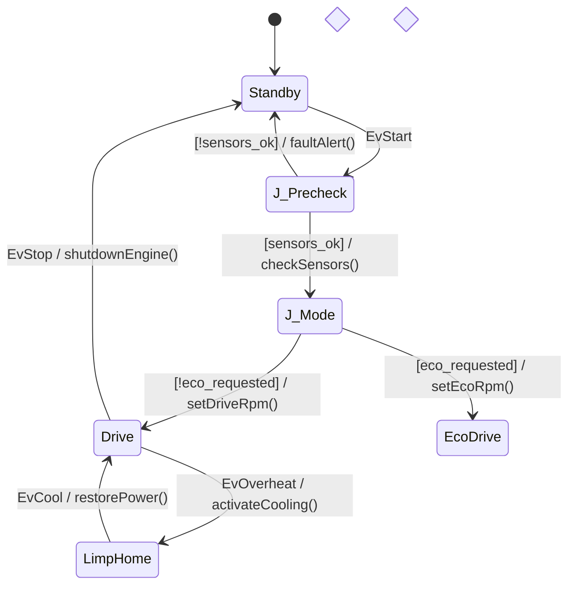

# Showcase 06: Stateflow Digital Twin ECU & Zero-Heap Snapshot Recorder

Demonstrates end-to-end industrial Model-Based Systems Engineering (MBSE) with **MathWorks Simulink Stateflow**, the middle-end **Connective Junction Chaining Pass**, and embedded zero-allocation **Time-Travel Snapshot Rollback**.

---

## 🎯 Architectural Highlights

1. **Simulink Stateflow Chart Ingestion (`.sfx`)**:
   - Directly compiles MathWorks Stateflow XML charts containing decision logic, connective flow junctions, and actions.
2. **Connective Junction Chaining**:
   - Multi-hop junction paths with guards:
     $$\text{Standby} \xrightarrow{\text{EvStart}} J_{\text{Precheck}} \xrightarrow{[\text{sensors\_ok}]} J_{\text{Mode}} \xrightarrow{[\text{eco\_requested}]} \text{Drive}$$
     are collapsed at compile-time by `ConnectiveJunctionChainingPass` into single atomic transitions with conjoined boolean guards and ordered action sequences.
3. **Zero-Heap Time-Travel Snapshot Recorder**:
   - `fsm::snapshot_recorder<Capacity, MaxSize>` provides a circular ring buffer for runtime execution trace recording with FNV-1a checksum validation, microsecond timestamps, and time-travel rollback (`recorder.record(...)`, `recorder.rewind_to_checkpoint(...)`).

---

## 📊 Stateflow Decision Topology



---

## ⏱️ Time-Travel Rollback Code Pattern

How the supervisory digital twin records and restores state in microseconds without dynamic allocations:

```cpp
#include "ecu_fsm.hpp"

automotive::ecu::EcuEngineFSM ecu;

// 1. Create a zero-allocation snapshot ring buffer (16 snapshots, 512 bytes each)
fsm::snapshot_recorder<16, 512> recorder;

// 2. Take a snapshot at a known healthy checkpoint
recorder.record(ecu, 200 /* Checkpoint Tag: HealthyDrive */);

// 3. Inject fault / anomaly
ecu.dispatch(EvOverheat{});
assert(ecu.is_in_state<LimpHome>());

// 4. Time-travel rollback: restores state vector and registers atomically
bool restored = recorder.rewind_to_checkpoint(ecu, 200);
assert(restored && ecu.is_in_state<Drive>());
```

---

## How to Build and Run

### Via CMake (Automated Transpilation)

```bash
# Build the showcase binary:
cmake -B build -S . -DCMAKE_BUILD_TYPE=Release
cmake --build build --target stateflow_digital_twin_ecu_example

# Run the test binary:
./build/bin/stateflow_digital_twin_ecu_example
```

### Inspecting Intermediate Representation via `fsm-opt`

To inspect how the `ConnectiveJunctionChainingPass` flattens the multi-hop junctions into canonical transitions:

```bash
# From examples/06_stateflow_digital_twin_ecu/:
fsm-opt -i ecu.sfx --passes=connective-junction-chaining --emit-ir
```

---

## Expected Output

```text
============================================================================
 Showcase 06: Stateflow Digital Twin ECU & Zero-Heap Snapshot Recorder
============================================================================

[Step 1] Initializing Digital Twin ECU in Standby state...
  -> Snapshot 1 recorded (Tag: 100 [Standby], Size: 32 bytes)

[Step 2] Dispatching EvStart (sensors_ok=true, eco_requested=false)...
  [ECU Action] Chained: checkSensors() -> setDriveRpm() (Target: 2200 RPM)
  -> Connective Junction Chaining Pass collapsed 2 intermediate junctions!
  -> Active state arrived atomically at: Drive
  -> Snapshot 2 recorded (Tag: 200 [HealthyDrive])

[Step 3] Simulating coolant radiator failure: engine_temp rises to 112 deg C...
  [ECU Action] activateCooling() -> Radiator fan 100% PWM
  -> Overheat guard triggered -> Active state transitioned to: LimpHome

[Step 4] Supervisory HIL Digital Twin triggers Time-Travel Rollback...
  -> Restoring ECU to previous checkpoint 200 (HealthyDrive)...
  -> Rollback Successful! Active state restored to: Drive

[Step 5] Graceful engine shutdown...
  [ECU Action] shutdownEngine() -> Injection cutoff
  -> Active state returned to: Standby

============================================================================
 [SUCCESS] Stateflow Digital Twin ECU & Snapshot Rollback Showcase PASSED!
============================================================================
```
